<h1 align="center">Vision-Obstacle-Avoidance-Robot</h1>

<p align="center">
  A differential-drive robot that drives to a goal and gets around obstacles
  using a camera, three ultrasonic sensors and wheel odometry.
  <br>
  My BSc final project in Electrical Engineering (Control) at
  <a href="https://www.iust.ac.ir/">Iran University of Science and Technology</a>.
</p>

<p align="center">
  
  
  
  
  
</p>

<p align="center">
  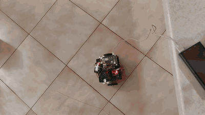
  &nbsp;
  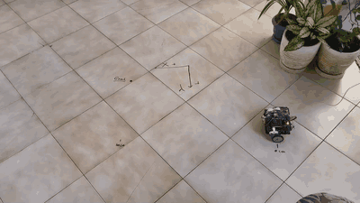
</p>

<p align="center"><sub>
  Left: going to (150, 0) with two obstacles in the way (2.5× speed).
  Right: going to (100, −50) and turning back to 0° at the end (1.5× speed).
</sub></p>

---

## What's in here

The robot has two brains that talk over a serial line:

- an **Arduino Uno** that only knows how to get to a pose `(x, y, φ)`. It
  runs the wheel speed loops, keeps track of where the robot is from the
  encoders, and drives there with a go-to-goal controller.
- a **Raspberry Pi 4** that keeps an eye on the ultrasonic sensors. When
  something gets closer than 20 cm it stops the robot, looks around with
  the camera on a servo, picks the freest direction with the *bubble
  rebound* algorithm, takes a short detour that way and then sends the goal
  again.

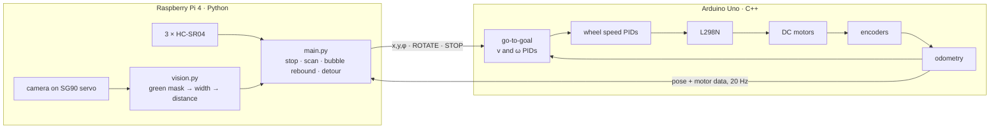

The details (the math, the gains, why things are the way they are) are in
[**docs/how_it_works.md**](docs/how_it_works.md).

## Results

All the runs were done on 16 Shahrivar 1403 (Sept 2024) on a tiled floor.
Positions are from the wheel encoders only, there was no external tracking.

| Run | Path | Video |
|---|---|---|
| (0, 0) → (100, 0) | 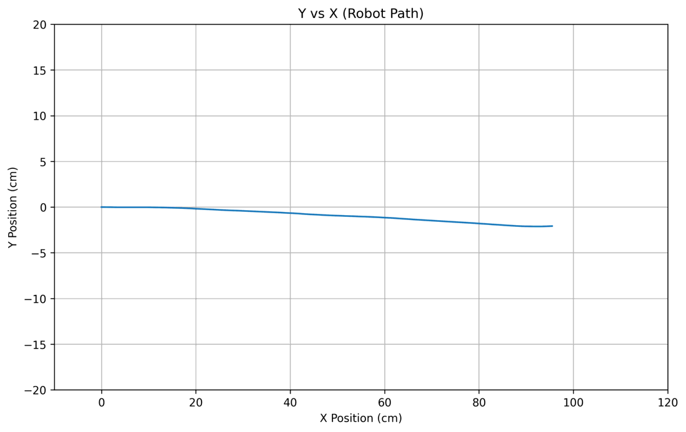 | [mp4](media/videos/goal_100_0.mp4) |
| (0, 0) → (100, −50), then turn to 0° | 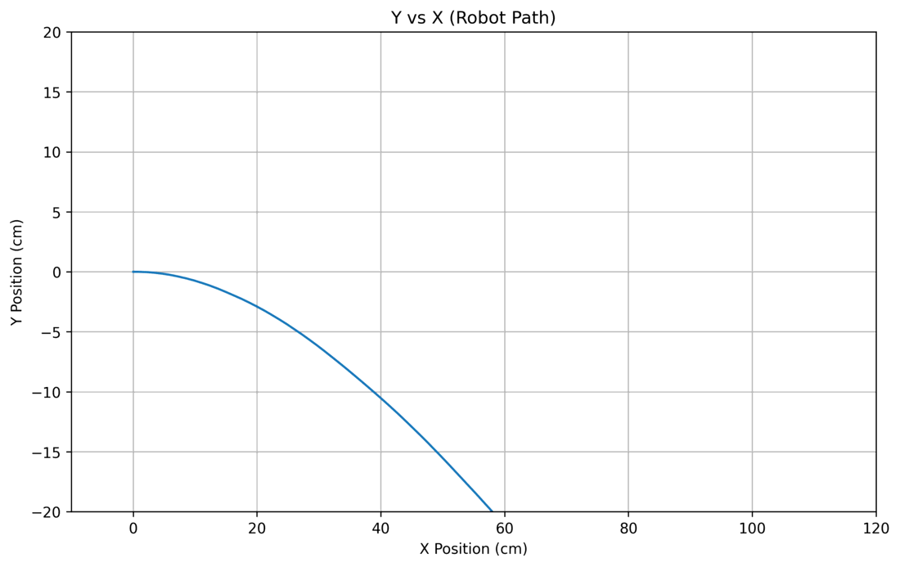 | [mp4](media/videos/goal_100_-50.mp4) |
| (0, 0) → (0, 100) | 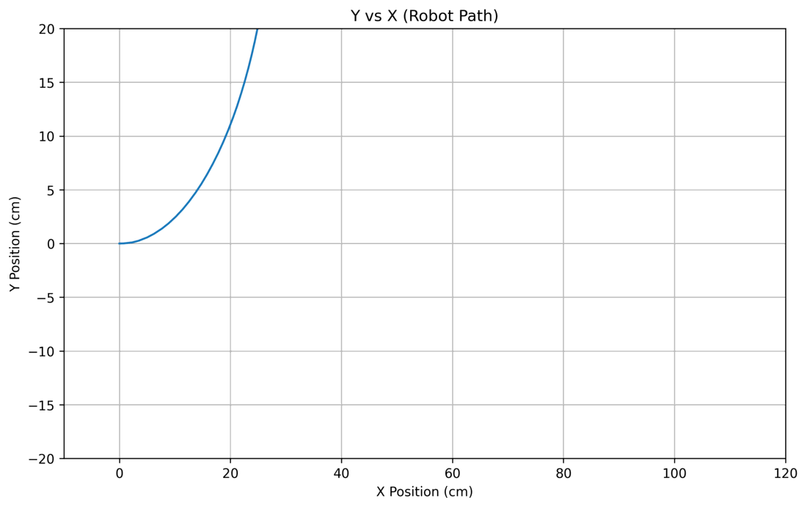 | [mp4](media/videos/goal_0_100.mp4) |
| (0, 0) → (200, 0), three obstacles, goes around them | 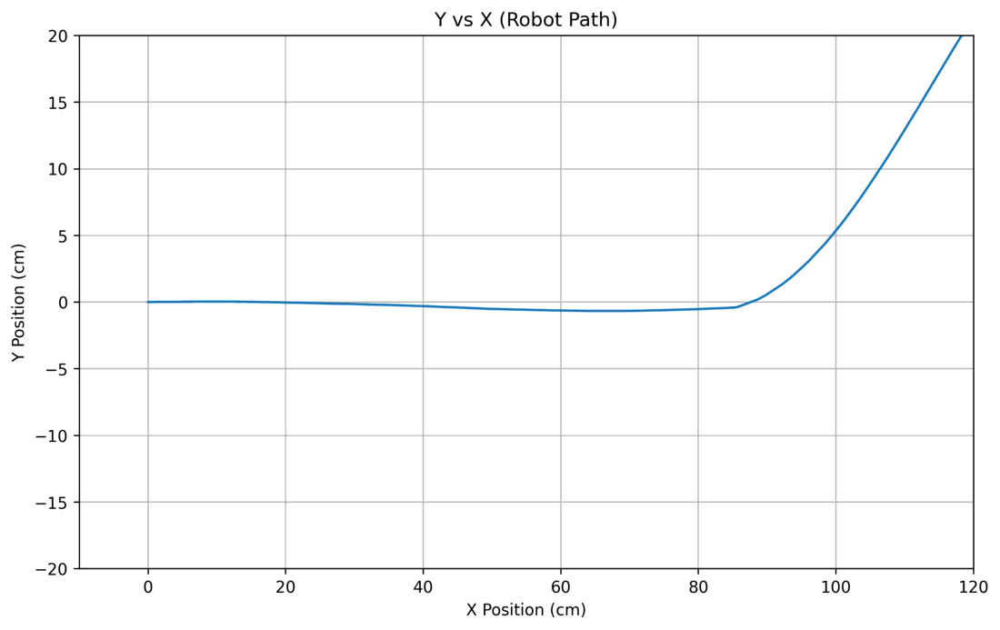 | – |
| (0, 0) → (150, 0), two obstacles, goes between them | 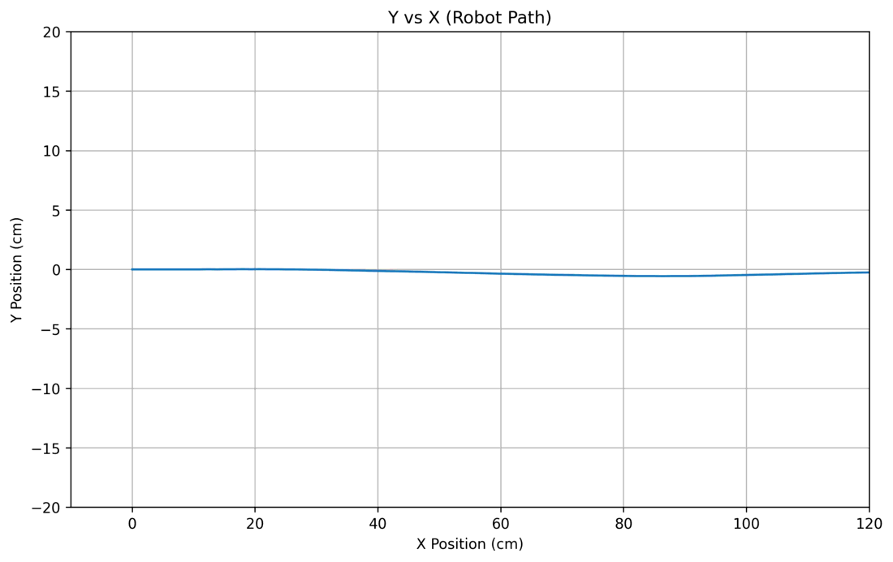 | [mp4](media/videos/obstacles_150_0.mp4) |

By its own odometry it reached every goal with a small error (it stops once
it's within 5 cm). The logs behind these are in [`data/`](data), and any of
them can be re-plotted:

```bash
python analysis/plot_run.py data/logs/obstacles_200_0.txt --goal 200 0
```

<p align="center">
  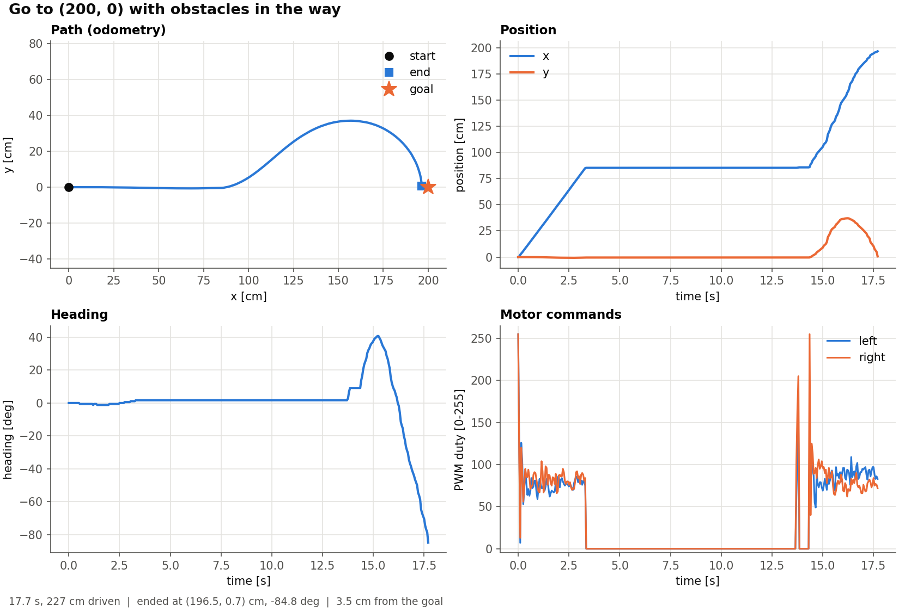
</p>

## The robot

<p align="center">
  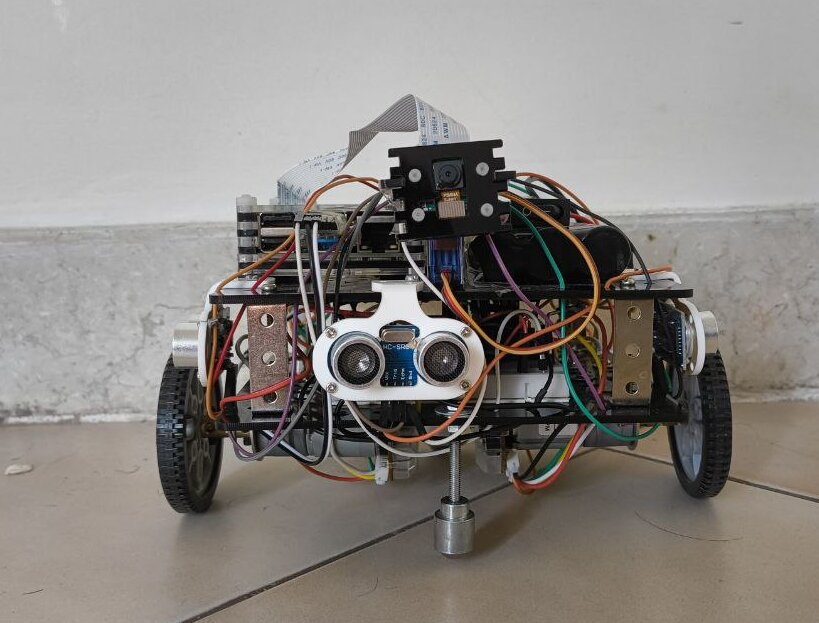
  &nbsp;
  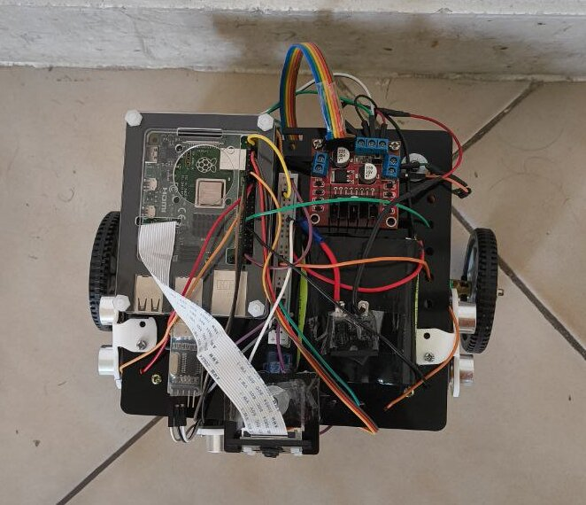
</p>

| Part | Details |
|---|---|
| Low level | Arduino Uno, L298N, 2 × 12 V gear motors with MITSUMI encoders (2625 pulses/rev) |
| High level | Raspberry Pi 4 (8 GB), Pi Camera v1.3 on an SG90 servo, 3 × HC-SR04 |
| Link | UART at 115200 baud through a USB-TTL adapter |
| Power | 12 V Li-ion pack (3 cells, 2.5 Ah) |
| Size | 16 × 14 cm, wheel radius 3 cm, 20.5 cm between the wheels |

Parts list and full wiring: [**docs/hardware.md**](docs/hardware.md).
Pi ↔ Arduino messages: [**docs/serial_protocol.md**](docs/serial_protocol.md).

## Repository layout

```
├── firmware/GotoXYPHI_UART/   Arduino sketch: wheel PIDs, odometry, go-to-goal
├── raspberry_pi/
│   ├── main.py                high-level loop: watch, stop, scan, detour
│   ├── robot/                 config, serial link, sensors, camera, avoidance
│   ├── tools/                 reference image capture + focal length calibration
│   └── calibration/           reference image of the obstacle at 30 cm
├── analysis/                  log parser and plotting script
├── data/logs/                 odometry logs from the test runs
├── docs/                      how it works, hardware, protocol, figures, the thesis
├── media/                     GIFs and the test videos
└── tests/                     tests for everything that doesn't need the robot
```

## Running it

### 1. Arduino

Open `firmware/GotoXYPHI_UART/GotoXYPHI_UART.ino` in the Arduino IDE,
pick **Arduino Uno** and upload. No extra libraries needed.

You can already drive it from any serial terminal at 115200 baud, e.g. send
`50,0,90` to go half a meter forward and turn left.

### 2. Raspberry Pi

On Raspberry Pi OS:

```bash
sudo apt install python3-serial python3-pigpio pigpio python3-opencv python3-picamera2
sudo systemctl enable --now pigpiod

git clone https://github.com/Arshiagosh/Vision-Obstacle-Avoidance-Robot.git
cd Vision-Obstacle-Avoidance-Robot/raspberry_pi

python3 main.py 200 0              # go to (200, 0) cm and avoid obstacles on the way
python3 main.py 100 -50 --phi 90   # also end up facing 90°
python3 main.py 100 0 --no-avoid   # plain go-to-goal, no sensors needed
```

If apt can't find `pigpio` (it's not packaged on the newest releases),
[build it from source](https://abyz.me.uk/rpi/pigpio/download.html).

Each run is logged to `raspberry_pi/runs/`. Pins, thresholds and the camera
calibration are all in [`robot/config.py`](raspberry_pi/robot/config.py).

If you use different obstacles or move the camera, recalibrate the focal
length: put the obstacle 30 cm in front of the camera, then

```bash
python3 tools/capture_reference.py   # press c to save the frame
python3 tools/calibrate_focal.py     # prints the focal length to put in config.py
```

### 3. On a laptop

The tests and the plotting script don't need any hardware:

```bash
pip install -r requirements-dev.txt
pytest
python analysis/plot_run.py data/logs/goal_100_-50.txt --goal 100 -50
```

## Limitations and what I'd do next

- **Odometry only.** The pose comes purely from the encoders, so it drifts
  with wheel slip. An IMU fused with the encoders through a Kalman filter
  would be the first upgrade.
- **The camera only sees green.** Detection is a color mask tuned for the
  test obstacles, and the distance comes from their known width. A laser
  rangefinder or a depth camera would give much better distances on any
  kind of object.
- **Reactive avoidance.** Bubble rebound only looks at what's right in front
  of it. It's not optimal, the motion isn't smooth, and it needs a planner on
  top for anything maze-like.
- **Breadboard wiring.** A proper board for each layer would make the whole
  thing a lot more robust mechanically and electrically.
- **ROS.** Moving the high-level side to ROS would make it much easier to
  plug in mapping, planning and simulation.

## The thesis

The full report (in Persian) is in
[`docs/report/Goshtasbi_BSc_Thesis_fa.pdf`](docs/report/Goshtasbi_BSc_Thesis_fa.pdf):
*Design, Construction and Control of a Wheeled Mobile Robot for Obstacle
Avoidance Using a Camera and Image Processing*, supervised by
Dr. Mohammad Farrokhi, Summer 1403 (2024).

If you use anything from here:

```bibtex
@thesis{goshtasbi2024robot,
  author = {Goshtasbi, Arshia},
  title  = {Design, Construction and Control of a Wheeled Mobile Robot for
            Obstacle Avoidance Using a Camera and Image Processing},
  type   = {B.Sc. thesis},
  school = {Iran University of Science and Technology},
  year   = {2024},
  url    = {https://github.com/Arshiagosh/Vision-Obstacle-Avoidance-Robot}
}
```

## Acknowledgments

Huge thanks to Dr. Farrokhi for guiding me through every stage of this
project, and for teaching me a lot about critical thinking and doing research
along the way.

## License

[MIT](LICENSE)
