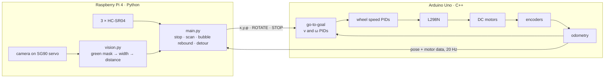
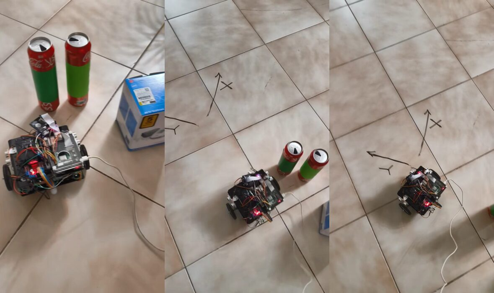
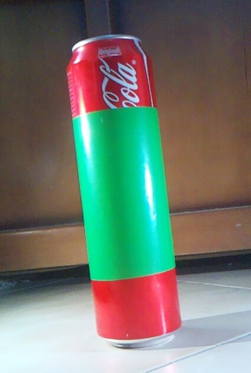
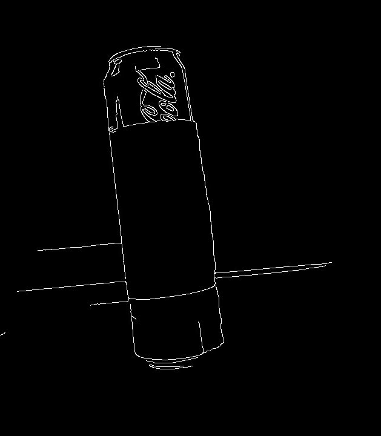

# How it works

The control is split in two layers that talk over a serial line:

- **Low level, Arduino Uno** — knows nothing about obstacles. Give it a pose
  and it gets there using the wheel encoders.
- **High level, Raspberry Pi** — watches the ultrasonic sensors and the
  camera, decides *where* to go and sends poses down.



---

## Low level (Arduino)

Everything here runs every 10 ms. Code:
[`firmware/GotoXYPHI_UART/GotoXYPHI_UART.ino`](../firmware/GotoXYPHI_UART/GotoXYPHI_UART.ino).

### 1. Wheel speed

The encoder pulses counted in the last tick give the wheel speed

```math
\omega_{rpm} = \frac{\Delta n}{2625}\cdot\frac{60}{\Delta t}
```

which is very noisy at 10 ms, so it goes through a first-order low-pass
filter (cut-off around 2.5 Hz):

```math
\bar\omega_k = 0.854\,\bar\omega_{k-1} + 0.0728\,(\omega_k + \omega_{k-1})
```

Each wheel has its own PID from the speed set-point to the PWM duty. To tune
them, I fed step inputs (forward and backward, to see the backlash) to each
motor, logged the speed over serial, identified a one-pole model with
MATLAB's System Identification Toolbox and got the gains from PID Tuner, then
touched them up on the floor:

| Loop | $`K_p`$ | $`K_i`$ | $`K_d`$ |
|---|---|---|---|
| left wheel | 4 | 0.2 | 0.005 |
| right wheel | 4 | 0.25 | 0.005 |

### 2. Odometry

There's no IMU or GPS, so the pose comes from the encoders alone. With
$`D_R, D_L`$ the distance each wheel rolled in the last tick and $`L = 20.5`$ cm
the distance between the wheels:

```math
D_C = \frac{D_R + D_L}{2},\qquad
\varphi \leftarrow \varphi + \frac{D_R - D_L}{L},\qquad
x \leftarrow x + D_C\cos\varphi,\qquad
y \leftarrow y + D_C\sin\varphi
```

This drifts over time (wheel slip, uneven floor), which is fine for runs of a
couple of meters but is the first thing to improve (see the README).

### 3. Go to goal

The robot is treated as a unicycle,

```math
\dot x = v\cos\varphi,\qquad \dot y = v\sin\varphi,\qquad \dot\varphi = \omega
```

and two outer PIDs pick $`v`$ and $`\omega`$:

- $`v`$ from the distance to the goal $`d = \sqrt{(x_g - x)^2 + (y_g - y)^2}`$,
  which slows it down as it gets close,
- $`\omega`$ from the heading error $`\varphi_d - \varphi`$, with
  $`\varphi_d = \operatorname{atan2}(y_g - y,\; x_g - x)`$ wrapped to $`(-\pi, \pi]`$.

| Loop | $`K_p`$ | $`K_i`$ | $`K_d`$ | limit |
|---|---|---|---|---|
| linear ($`v`$) | 8 | 2 | 1.5 | ±300 |
| angular ($`\omega`$) | 10 | 0 | 1.5 | ±30 while turning in place |

$`(v, \omega)`$ then become wheel set-points with

```math
\omega_R = \frac{2v + \omega L}{2R},\qquad \omega_L = \frac{2v - \omega L}{2R}
```

where $`R = 3`$ cm is the wheel radius.

### 4. Final heading

Once it's within **5 cm** of the goal it stops, prints `Target Reached.`, and
turns in place ($`v = 0`$, so the wheels spin opposite ways) until the heading
error is under **0.03 rad**. Then it prints `Orientation Reached.` and idles.
The same turn-in-place is what the `ROTATE` command uses.

---

## High level (Raspberry Pi)

Code: [`raspberry_pi/main.py`](../raspberry_pi/main.py) and the
[`robot/`](../raspberry_pi/robot) package.

The Pi sends the goal and then keeps polling the three ultrasonic sensors
(front, left, right). As long as nothing is closer than **20 cm**, it just
lets the Arduino drive. When something is:

<p align="center">
  
</p>

1. **Stop.**
2. **Scan** seven directions. Directions are measured from the robot's right
   side, so 0° is right, 90° is straight ahead and 180° is left:

   | Direction | 0° | 30° | 60° | 90° | 120° | 150° | 180° |
   |---|---|---|---|---|---|---|---|
   | Sensor | right HC-SR04 | camera | camera | camera | camera | camera | left HC-SR04 |

   The servo turns the camera to each of the five middle directions and
   waits a second for the image to settle before measuring.
3. **Pick a direction** with the bubble rebound rule (below).
4. **Turn** to it in place and **drive 20 cm** that way.
5. **Send the original goal again** and keep watching.

### Bubble rebound

From Susnea, Minzu and Vasiliu [1]. Only obstacles inside a "sensitivity
bubble" around the robot matter, so every reading $`d_i`$ is clipped to the
bubble radius (20 cm), and a direction where nothing was seen counts as fully
free. The escape direction is the average of the directions, each weighted by
how much free space there is that way:

```math
\alpha = \frac{\sum_i \theta_i\, d_i}{\sum_i d_i}
```

$`\alpha = 90^\circ`$ means straight ahead, more than that turns left, less turns
right. The new heading is $`\varphi + (\alpha - 90^\circ)`$.

For example, with something close on the right (5, 6, 8 and 10 cm at 0°, 30°,
60°, 90°) and nothing on the left, $`\alpha \approx 118.7^\circ`$, so the robot turns
about 29° to the left.

It's cheap, works with cheap sensors and reacts to things that move, but it's
purely reactive. In the thesis I listed its weak spots: the path is far from
optimal, the motion isn't smooth, and it needs a planner on top for maze-like
places. On top of that, a perfectly symmetric scene gives $`\alpha = 90^\circ`$,
i.e. no turn at all.

### Measuring distance with the camera

The test obstacles were green, so detection is an HSV color mask
(H 35–85, S and V ≥ 40), then contours, then the bounding box of the biggest
blob that is at least 600 px² and mostly green:

<p align="center">
  
  &nbsp;
  
</p>

With the real width of the obstacle $`W`$ known (6.75 cm), the pinhole camera
model gives the distance from the width $`w`$ of the box in pixels:

```math
d = \frac{W\, f}{w}
```

The focal length $`f`$ in pixels comes from one reference photo of the
obstacle at a known distance $`d_0`$ (30 cm): $`f = w_0 d_0 / W`$.
[`tools/calibrate_focal.py`](../raspberry_pi/tools/calibrate_focal.py) does
that. The robot ran with $`f = 915.6`$ px; the reference image that's in the
repo now gives 817.8 px, so it's worth recalibrating before trusting the
numbers.

The thesis also goes over a ground-plane method that only needs the camera
height [2]. What's in the code is the simpler known-width version.

---

## References

1. I. Susnea, V. Minzu, G. Vasiliu, "Simple, real-time obstacle avoidance
   algorithm for mobile robots," *8th WSEAS International Conference on
   Computational Intelligence, Man-Machine Systems and Cybernetics
   (CIMMACS '09)*, 2009.
2. S. Diamantas, S. Astaras, A. Pnevmatikakis, "Depth estimation in still
   images and videos using a motionless monocular camera," *IEEE
   International Conference on Imaging Systems and Techniques (IST)*, 2016.
3. R. Siegwart, I. Nourbakhsh, D. Scaramuzza, *Introduction to Autonomous
   Mobile Robots*, 2nd ed., MIT Press, 2011.
4. J. Borenstein, H. R. Everett, L. Feng, *Where am I? Sensors and Methods for
   Mobile Robot Positioning*, University of Michigan, 1996.
